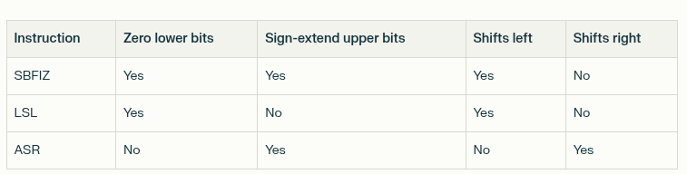

##Differences

Key ones:
    
    1. Category: others -> Literal Translation Artifact -> affect only performance
    * Description: The goal is to perform two allocations:
        malloc(N * 8)
        malloc(N + 1)
    * Code: 
        ####gd:   
            ; x20 contains N
            ; --- First malloc size calculation ---
            [
            sbfiz	x0, x0, #3, #32   ; x0 = (N << 3) 
            ]
            bl	_malloc

            ; --- Second malloc size calculation ---
            mov	    x8, #4294967296         ; x8 = 2^32
            [
            add	    x8, x8, x20, lsl #32   ; x8 = x8 + (x20 << 32)
            ]
            asr	    x0, x8, #32            ; x0 = x8 >> 32
            bl	_malloc

        ####pred:
            ; x20 contains N
            ; --- First malloc size calculation ---
            [
            lsl	x23, x0, #32        ; x23 = N << 32 (Create intermediate value)
            asr	x0, x23, #29        ; x0 = x23 >> 29.  (N << 32) >> 29  ==> N * 8
            ]
            bl	_malloc

            ; --- Second malloc size calculation ---
            mov	x8, #4294967296     ; x8 = 2^32
            [
            add	x8, x23, x8         ; x8 = x23 + x8
            ]
            asr	x0, x8, #32         ; x0 = x8 >> 32
            bl	_malloc
    * x86 reasoning:
        * Root Cause: This appears to be a translation error from x86 assembly where the original code used
        [x86]: 	
            ; rax contains strlen result, N
            movq	%rax, %rbx          ; rbx = N
            shlq	$32, %rbx           ; rbx = N << 32 <-- CREATION OF INTERMEDIATE VALUE

            ; --- First malloc size calculation ---
            movq	%rbx, %rdi          ; rdi = rbx
            sarq	$29, %rdi           ; rdi = (N << 32) >> 29 ==> N * 8
            callq	_malloc

            ; --- Second malloc size calculation ---
            movabsq	$4294967296, %rdi   ; rdi = 2^32
            addq	%rbx, %rdi          ; rdi = rdi + rbx  ==> 2^32 + (N << 32)
            sarq	$32, %rdi           ; rdi = (rdi) >> 32 ==> N + 1
            callq	_malloc
    
    2. Category -> incorrect use of x0 (based on %rax usage) OR array_pointer issue OR incorrect store 
    * Description: use x0 as both base and offset
    * Code: 
        [gd]:
        ```asm
        ldrb	w8, [x21], #1   ; load str[i], increment pointer
        add	x9, x0, x24     ; calculate address: current + current_len
        strb	w8, [x9]        ; store character at correct position
        strb	wzr, [x9, #1]   ; null terminate at next position
        ```
        [pred]:
        ```asm
        ldrb	w8, [x21], #1   ; load str[i], increment pointer  
        strb	w8, [x0, x0]    ; ❌ CRITICAL ERROR: uses x0 as both base and offset
        strb	wzr, [x0, #1]   ; null terminate at wrong position
        ```
