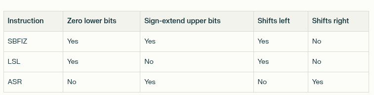

##Differences

Key ones:
    
    1. Category: others -> failed to correctly calculate the stack offsets
    * Description: it needs three bytes in a row to be freed bt zeros -> pred do only to of them 
    * Code: 
        ####gd:
            strb	wzr, [sp, #14]
	        strh	wzr, [sp, #12]
        ####pred:
            strb	wzr, [sp, #15]
	        strh	wzr, [sp, #14]
    * COMMENT: affects later on code, where the logical flow itself is correct, but buffer initially was not set correctly
        * Code:
        gd.txt (Correct)	pred.txt (Incorrect)
        add x0, sp, #12	    add x0, sp, #14
        bl _strlen	        bl _strlen
        cmp x0, #1	        cmp x0, #1
        ...	...
        add x8, sp, #12	    add x8, sp, #14
        add x8, x8, x0	    add x8, x8, x0
        strb w19, [x8]	    strb w21, [x8]
    
        * Also affects section **LBB0_14**

    2. Category: Handling loop differently -> fine -> no logical error -> Stylictic difference
    * Parts/Sections of code: LBB0_9,  
    3. Category: Handling buffer accessing differently 
    * Description: pred ones can be less effective
    * Code:
        gd.txt (Correct)	    pred.txt (correct)
        add x20, x20, #1	    add x23, x23, #1
        subs x22, x22, #1	    cmp x22, x23
        b.eq LBB0_20	        b.eq LBB0_21
        ldrb w19, [x20]	        ldrb w21, [x20, x23]
    4. Category: Storing incorrect value + taking it from register, instead off using immidiate velue
    * Description: This suggests GD is handling the ".|" note case (which should store value 1), while PRED is incorrectly storing value 4 (which should be for "o" notes).
        * Same with **LBB0_14** part
    * Code:
        GD.txt:
        LBB0_4:                                 ;   in Loop: Header=BB0_5 Depth=1
            add	x20, x20, #1
            subs	x22, x22, #1
            b.eq	LBB0_20
        PRED.txt:
        LBB0_4:                                 ;   in Loop: Header=BB0_5 Depth=1
            add	x23, x23, #1
            cmp	x22, x23
            b.eq	LBB0_21
    5. Category: Different comparison logic -> no logical error
        * Code: LBB0_10
    6. Category: doesn't update the array pointer after realloc, leading to potential use of freed memory 
    * Description: Missing mov instructions
    * Code: ; %bb.8 -> last lines -> no code in pred
            mov	x0, x21
            bl	_realloc
            mov	x21, x0
        %bb.12 and %bb.16 Section (Second Realloc Case) -> prediction code:
            bl	_realloc
	        mov	x25, x25

            
    7. Category: Branching to an incorrect function + not correct cleaun up function
    * Description: b.hi LBB0_19 vs b.hi LBB0_20
        * GD: Proper error handling - sets output to safe values (NULL pointer, 0 count)
        * PRED: MAJOR BUG - branches to a loop continuation instead of error handling
    * Code: 
    GD LBB0_19 (Error Path):
    LBB0_19:
        mov	w23, #0          ; Set count to 0
        mov	x21, #0          ; Set result array to NULL
    PRED LBB0_20 (Error Path):
    LBB0_20:                                ; =>This    Inner Loop Header: Depth=1
        strb	wzr, [sp, #14]              ; Clear string buffer
    
    8. Category -> missusing x0 -> isung it in computations AGAIN
    * Description: accessing freed memory. It's doing it cause it miss an instructions (mov) that will store new pointer to the array -> x0 co
    * Code: -> LBB0_13
        gd:
            str w8, [x21, w23, sxtw #2]    ; Uses x21 (array pointer) - CORRECT!
        pred: 
            str w28, [x0, w24, sxtw #2]    ; Uses x0 (realloc return) - WRONG!

                   

    